# A Sense of Security

Details:

    Author: Patrick Gillespie Jr.
    Framework Category: Operate and Maintain
    Specialty Area: Systems Analysis
    Work Role: Systems Security Analyst
    Task Description: Perform security reviews, identify gaps in security architecture, and develop a s\
                      ecurity risk management plan. (T0177)
Scenario:

    We have recently found that our core systems have never had a security review done since they were put up for use. 
    From management's understanding, the core systems in place have been set up to function but have not had any hardening 
    steps taken to protect them or the services they provide. We need you to review these core systems and services to 
    identify issues that lower or compromise the security posture of the company infrastructure. Your report will be s
    ubmitted for review so management can act on them on a future date.

Additional Information:

    More details and objectives about this challenge will be introduced during the challenge meeting, which will start 
    once you begin deploying the challenge.

    Hybrid challenges do not have checks, their only deliverable being usually a report or plan. This should be done 
    within the documentation tab of the workspace once the challenge is deployed. Below the main documentation section 
    be sure to include a tagged list of applications you used to complete the challenge.

Your username/password to access all virtual machines and services within the workspace will be the following...
    
    Username: playerone
    Password: password123

Meeting Notes:

> Thanh Akasaka
Hey @gthatcher, I was trying to get something working with my IDE so I could test some code and noticed that my firewall was off. Not sure if that was something that is of concern or not so I decided to make a ticket about it.

> Gary Thatcher
Thanks for letting me know @takasaka, but it shouldn't be a big deal because we just had a vendor put in that new pfSense firewall box that protects the whole network.

System

    Ticket closed by Gary Thatcher
    
System

      Ticket reopened by Gary Thatcher

> Gary Thatcher
So we just hired a new Security Analyst @playerone, and I wanted to reopen this ticket as a good first task. @playerone can you take a look into the status of our systems security? Go through each device on our network and make note of anything that stands out as a security issue - or potential security issue that we should consider changing. Don't worry about making any changes, this is just a review of where we are now. Your report will be used to make informed plan of actions.

> Gary Thatcher
Please include the following in your report for any issues you find: State the vulnerability, explain the vulnerability, explain why it may be a risk, and make recommendations on how this risk can be mitigated or fixed.

> Gary Thatcher
@playerone, you should look at the authentication and firewall settings on Prod-Web, Dev-Web, Database, and Domain-Controller servers as well as the operational security regarding their critical roles as web hosts (Apache, IIS), back-end database server (MySQL), and Active Directory respectively.

Network Map:

Work:

#I ran nmap script for all the 3 subnets:
	
#Change user to root
		
    Su -
    
#Changed directory

		cd /usr/share/nmap/scripts

#I ran the nmap script for all subnets 10, 20 and 30 and saved the output to vulnX.txt
		
    nmap 172.160.10.0/24 --script vuln -oN /root/Desktop/vuln10.txt
		
Subnet10 Nmap Scan Output

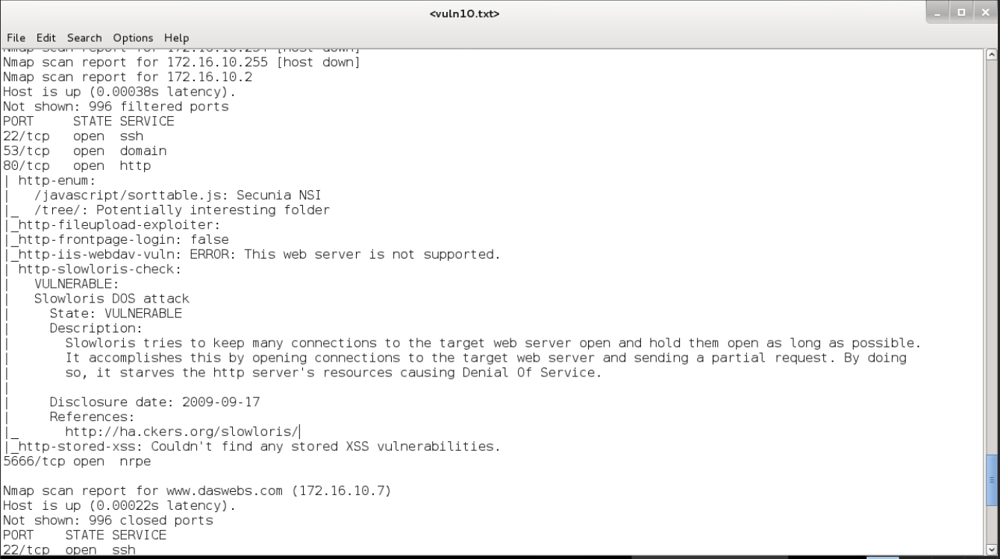
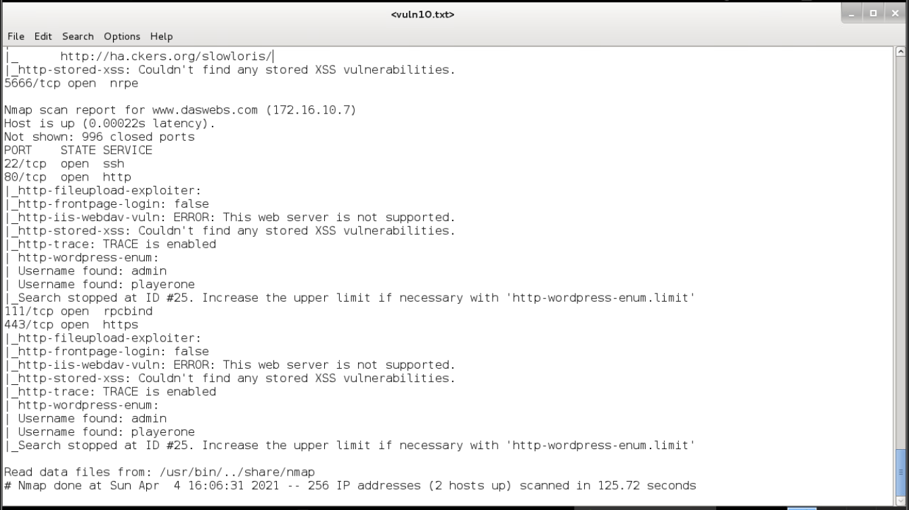

Subnet 20 Nmap Scan Output
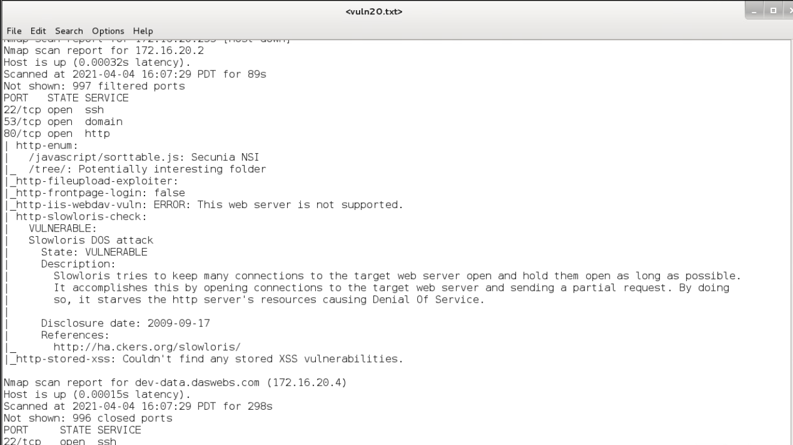
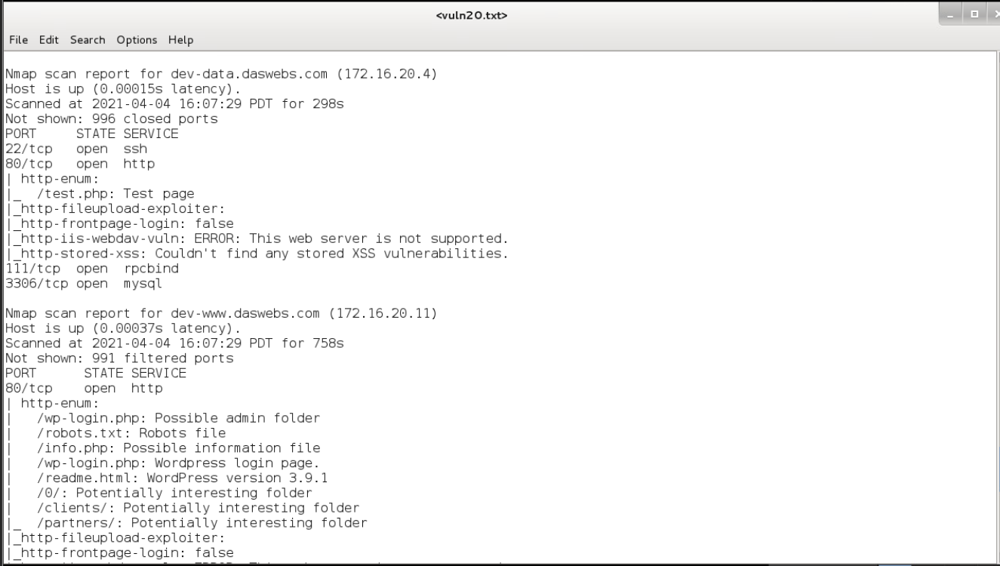
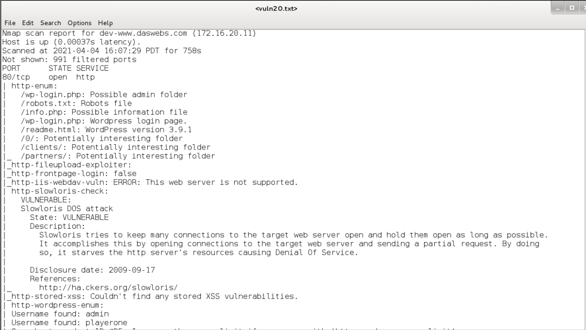
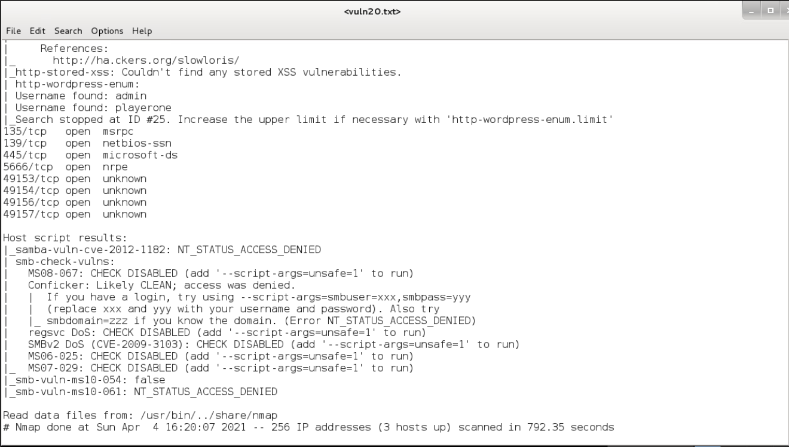

Subnet 30 Nmap Scan Output
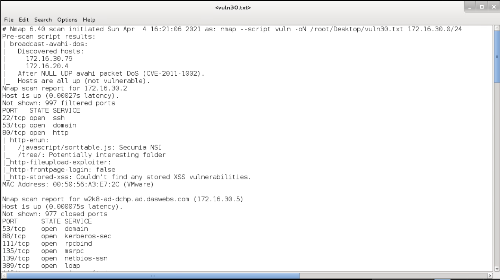
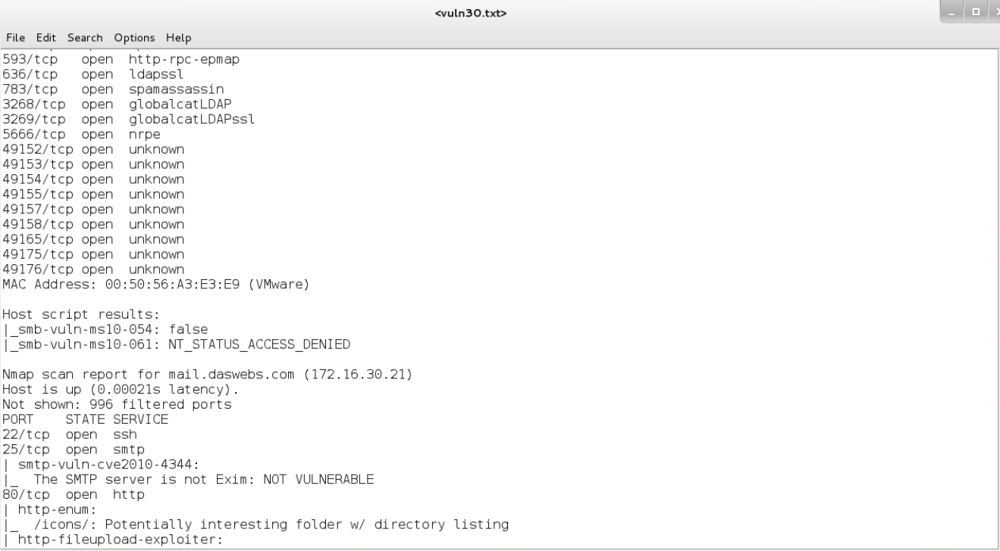
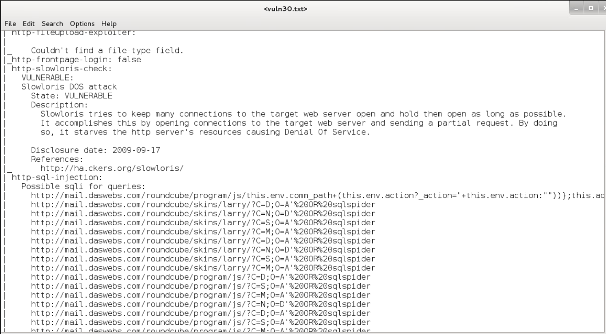
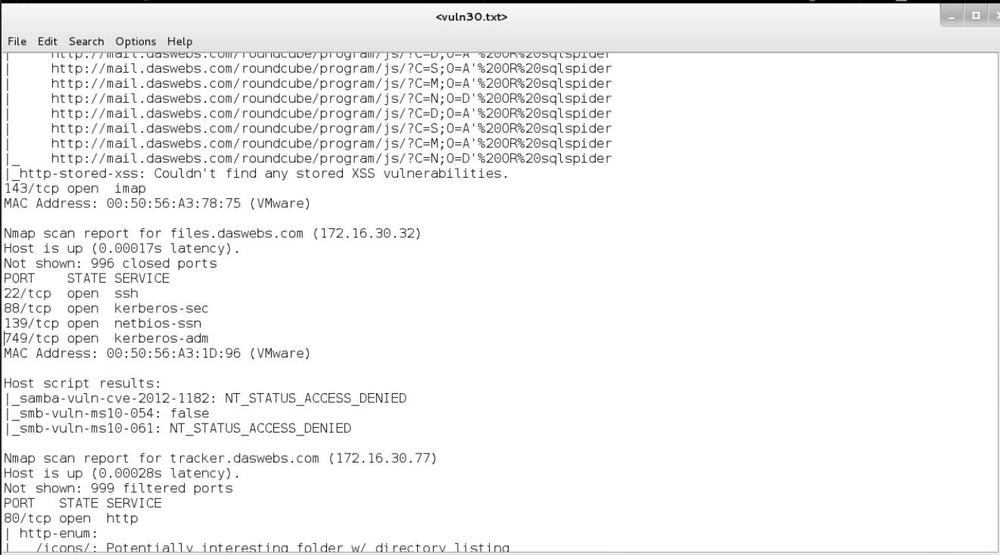
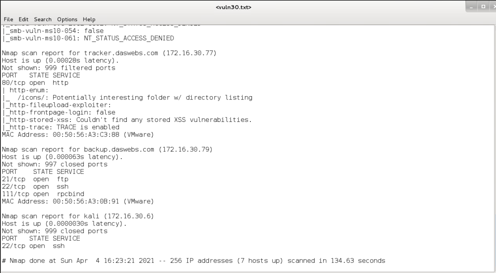

Obejective: State the vulnerability, explain the vulnerability, explain why it may be a risk, and make recommendations on how this risk can be mitigated or fixed.

1. The following are prone to the Slowloris DOS attack:
-

   - Web server 172.16.10.2 and 
   - Database server (172.16.20.4), 
   - mail.daswebs.com (172.16.30.21) 
	
 Vulnerability: 

  Slowloris DOS attack, this attack tries to keep many connections to the target web server open and hold them open as long as possible. it accomplishes this by opening connections to the target web server and sending a partial request. By doing so, it starves the HTTP server's resources causing Denial of service. 
	
 Mitigation: 
 
		- Slowloris DDoS attacks can be mitigated by following the following steps:
		- Increase the maximum number of clients the Web server will allow
		- Limit the number of connections a single IP address is allowed to attempt
		- Place restrictions on the minimum transfer speed a connection is allowed
		- Constrain the amount of time a client is permitted to stay connected.
	
  #In the case of Apache Web servers, several modules can be employed to prevent damage from a Slowloris DDoS attack. These modules include:
  
		- Mod_limitipconn
		- Mod_qos
		- Mod_evasive
		- Mod security
		- Mod_noloris
		- Mod_antiloris
		
  #Apache 2.2.15 includes the module mod_reqtimeout, which is the solution supported by the developers.
	Additional approaches for Slowloris DDoS protection include instituting reverse proxies, firewalls, load balancers or content switches.
	Source: https://www.netscout.com/what-is-ddos/slowloris-attacks

2. The listed host are proto brute force attack:
-

  - www.deswebs.com (172.16.10.7, 172.16.20.11) 
	
  Vulnerability: 
	
  weak password this can easily be exploited by brute force. A brute-force attack consists of an attacker submitting many passwords or passphrases with the hope of eventually guessing a combination correctly. The attacker systematically checks all possible passwords and passphrases until the correct one is found.
	
  Mitigation:
  
  	 - Change password to a strong one, make sure the new password meets the following characteristics
	 - At least 8 characters—the more characters, the better.
	 - A mixture of both uppercase and lowercase letters.
   	 - A mixture of letters and numbers.
	 - Inclusion of at least one special character, e.g., ! @ # ? ]

3. Unknow ports should be closed:
-
	   - 49152, 49153, 49154, 49155, 4915,49158, 49165,49175, and 49176 
  	   - should be closed if no applications are running on them, it is useful to know exactly what services/ processes are listening to them, and also recommend running multiple anti-virus/anti-malware scans to rule out the possibility of active malicious software.

