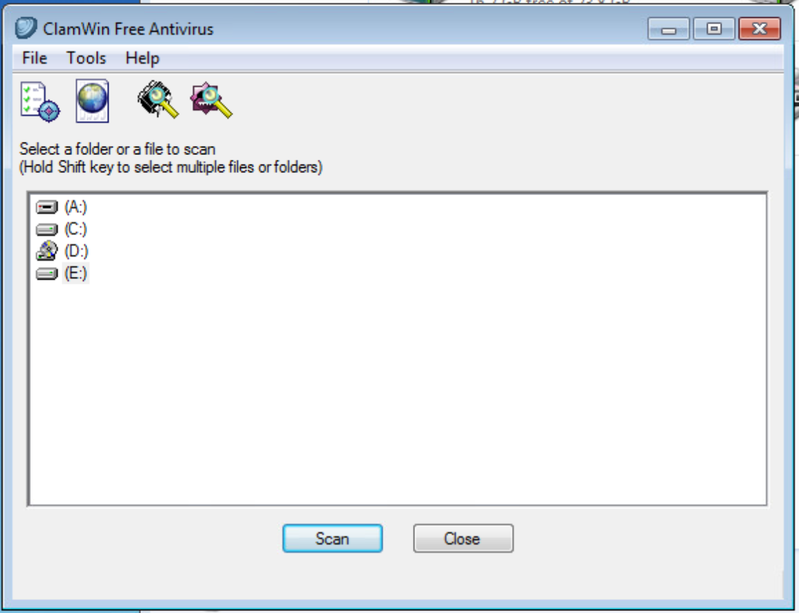

# 24 Dangerous Drives

## Details:

    Author: Brendan Higgins
    Framework Category: Investigate
    Specialty Area: Digital Forensics
    Work Role: Law Enforcement/CounterIntelligence Forensics
    Task Description: Perform virus scanning on digital media. (T0285)

## Before the Challenge 

## Scenario
    A USB thumb drive of unknown origin or owner has been found in the office. I need you to 
    check and verify that the thumb drive does not contain any malicious software that could 
    infect and damage the company's valuable data.
    
## Additional Information
    More details and objectives about this challenge will be introduced during the challenge 
    meeting, which will start once you begin deploying the challenge.

You will be able to check your progress during this challenge using the check panel within 
the workspace once the challenge is deployed. The checks within the check panel report on 
the state of some or all of the required tasks within the challenge.

Once you have completed the requested tasks, you will need to document the methodology you 
used with as much detail and professionalism as necessary. This should be done on the 
documentation tab within the workspace once the challenge is deployed. Below the main 
documentation section be sure to include a tagged list of applications you used to complete
 the challenge.

Your username/password to access all virtual machines and services within the workspace 
will be the following...
Username: playerone
Password: password123

Meeting Note

`Sergio Chanel`
Hey, tech guys, I found a thumb drive on the second floor near the HR area. I don't know 
whose it is and I don't really care either. I'm going to come drop it off later today 
because I'm sure you have more use for it than I do

`Gilly Bates`
I ran into Sergio in the halls and he handed me a random flash drive with little explanation 
but he said he made a ticket for it.

Anyways, I put it on your desk to look at, @playerone

`Thanh Akasaka`
@playerone, we have no idea where that drive came from, but it could be infected with viruses. 
I've heard from some forums I frequent that a lot of other sysadmins are trying to figure out 
the best way to stop USB drives from walking in the door and being plugged in by curious folks 
that inadvertently infect the whole company! Anyways, we're lucky that Sergio turned it in rather 
than rummaged through it's contents. Since he found it near HR it could just belong to someone 
there, but we can't be too sure, right? Its been plugged into Workstation-Desk we have set up as 
a sheep-dip, you can find it there. Make sure not to just delete the whole drive or entire 
directories because even if infected, it could also have some critical HR files on it. I think we 
have some sort of Antivirus on that workstation called Clam Scan or something that can scan removable 
media. Go check it out @playerone.

`Richard LeGrand`
I GUESS ITS LIKE THEY SAY - CURIOSITY KILLS THE CAT! HAHAHA
NOT FUNNY THOUGH YOU GUYS NEED TO CHECK THAT OUT.

`Thanh Akasaka`
I also noticed that the sheep-dip Workstation-Desk machine has been acting a bit weird when trying to 
open programs, no idea what happened there but I don't have time to look at it. So good luck.

## Network Map

## Solution Write Up:

1. Scan For Virus:
    -used the ClamWin antivirus (Run as administartor) to scan for virus on the flash drive located on the E:
	-Found 4 viruses
	-Deleted 1 and the rest three were hidden

Selected the drive to be scanned

Scanned the Flash drive E drive

2. Changing Hidden files settings:

    -Opened the flash drive
	-Clicked on organise on the menu bar
	-Clicked on Folder and search option
	-Clicked on the view menu
	-I Checked: Show hidden files, foldes and drives

    -I Unchecked: 
		Hide empty drives in the Computer
		Hide extension for known file types
		Hide protected operating system files (recommened)
        (unchecked and checked did, enabled me to locate the hidden files in there respective directory)

Got this prompt

3. Removing The Viruses:

Valentinesday.ptt.vsx

thumb.ini

extmenu.cfg

permanent.temp

# Completed

## NICE Framework KSA
## CAE Knowledge Units
## NICE Framework 1.0 KSA
## NICE Framework 1.0 Competencies

